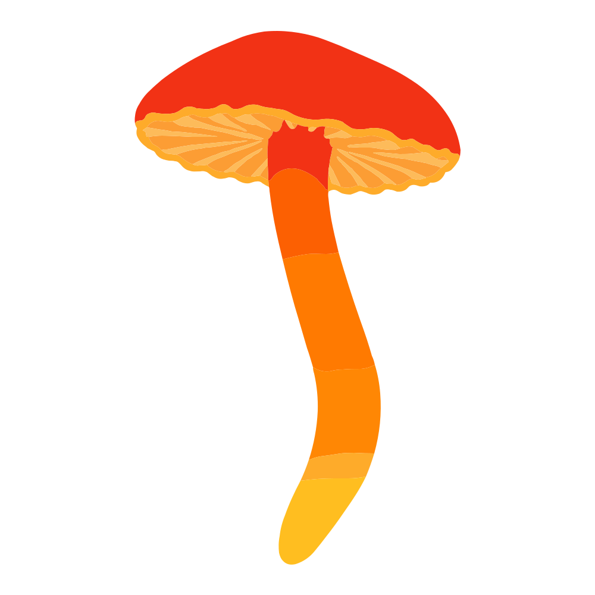
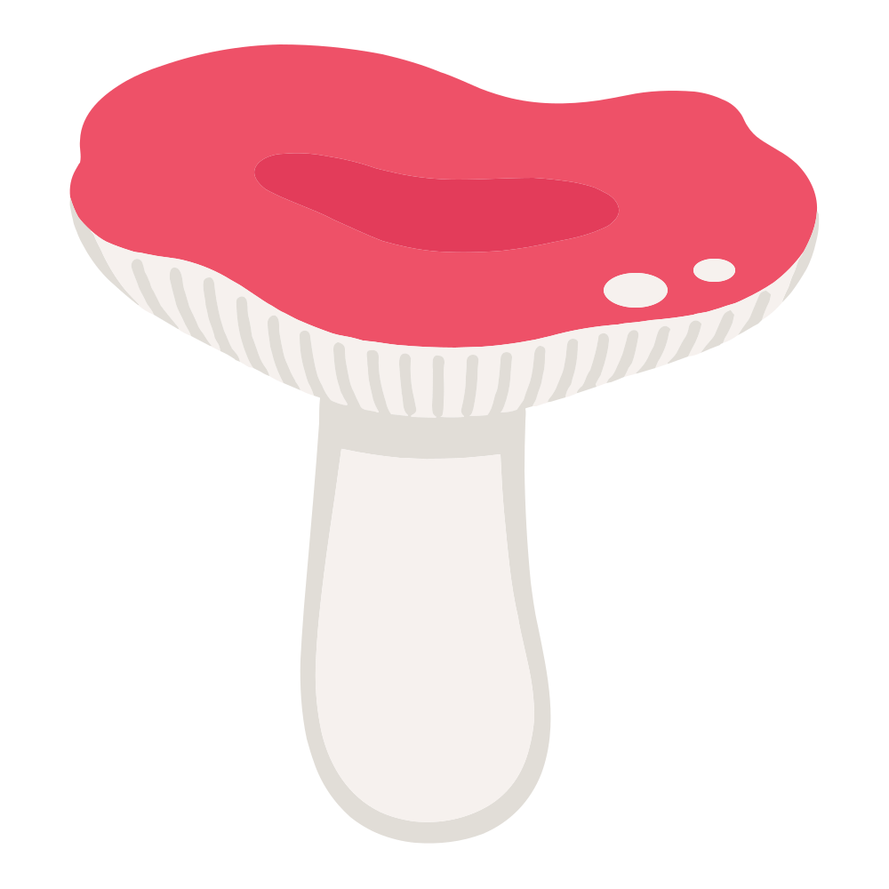

<!-- markdownlint-disable MD033 -->

# Mushroom Icons — pipeline & conventions

This project maintains a set of habitus-faithful mushroom SVG icons for use as foraging map markers, plus five derivative sets generated by a deterministic pipeline.

## Gallery

<p align="center"><em>39 species — click any icon to open the full squeezed-set sheet.</em></p>

<table align="center">
  <tr>
    <td align="center"><a href="Icons%20-%20Squeezed.html"></a></td>
    <td align="center"><a href="Icons%20-%20Squeezed.html"></a></td>
    <td align="center"><a href="Icons%20-%20Squeezed.html"></a></td>
    <td align="center"><a href="Icons%20-%20Squeezed.html"></a></td>
    <td align="center"><a href="Icons%20-%20Squeezed.html"></a></td>
  </tr>
  <tr>
    <td align="center"><a href="Icons%20-%20Squeezed.html"></a></td>
    <td align="center"><a href="Icons%20-%20Squeezed.html"></a></td>
    <td align="center"><a href="Icons%20-%20Squeezed.html"></a></td>
    <td align="center"><a href="Icons%20-%20Squeezed.html"></a></td>
    <td align="center"><a href="Icons%20-%20Squeezed.html"></a></td>
  </tr>
  <tr>
    <td align="center"><a href="Icons%20-%20Squeezed.html"></a></td>
    <td align="center"><a href="Icons%20-%20Squeezed.html"></a></td>
    <td align="center"><a href="Icons%20-%20Squeezed.html"></a></td>
    <td align="center"><a href="Icons%20-%20Squeezed.html"></a></td>
    <td align="center"><a href="Icons%20-%20Squeezed.html"></a></td>
  </tr>
  <tr>
    <td align="center"><a href="Icons%20-%20Squeezed.html"></a></td>
    <td align="center"><a href="Icons%20-%20Squeezed.html"></a></td>
    <td align="center"><a href="Icons%20-%20Squeezed.html"></a></td>
    <td align="center"><a href="Icons%20-%20Squeezed.html"></a></td>
    <td align="center"><a href="Icons%20-%20Squeezed.html"></a></td>
  </tr>
  <tr>
    <td align="center"><a href="Icons%20-%20Squeezed.html"></a></td>
    <td align="center"><a href="Icons%20-%20Squeezed.html"></a></td>
    <td align="center"><a href="Icons%20-%20Squeezed.html"></a></td>
    <td align="center"><a href="Icons%20-%20Squeezed.html"></a></td>
    <td align="center"><a href="Icons%20-%20Squeezed.html"></a></td>
  </tr>
  <tr>
    <td align="center"><a href="Icons%20-%20Squeezed.html"></a></td>
    <td align="center"><a href="Icons%20-%20Squeezed.html"></a></td>
    <td align="center"><a href="Icons%20-%20Squeezed.html"></a></td>
    <td align="center"><a href="Icons%20-%20Squeezed.html"></a></td>
    <td align="center"><a href="Icons%20-%20Squeezed.html"></a></td>
  </tr>
  <tr>
    <td align="center"><a href="Icons%20-%20Squeezed.html"></a></td>
    <td align="center"><a href="Icons%20-%20Squeezed.html"></a></td>
    <td align="center"><a href="Icons%20-%20Squeezed.html"></a></td>
    <td align="center"><a href="Icons%20-%20Squeezed.html"></a></td>
    <td align="center"><a href="Icons%20-%20Squeezed.html"></a></td>
  </tr>
  <tr>
    <td align="center"><a href="Icons%20-%20Squeezed.html"></a></td>
    <td align="center"><a href="Icons%20-%20Squeezed.html"></a></td>
    <td align="center"><a href="Icons%20-%20Squeezed.html"></a></td>
    <td align="center"><a href="Icons%20-%20Squeezed.html"></a></td>
  </tr>
</table>

## Directory layout

```text
uploads/                       drop new source SVGs here
icons/
  originals/                   verbatim copies of source SVGs
  simplified/                  seam strokes + white fills dropped; 1-dp coords
  unified/                     simplified + uniform 1000×1000 viewBox, centred
  squeezed/                    unified with baked transform + integer precision
  unified-original/            originals + white fills stripped + uniform viewBox
  species-data.js              metadata + filesize registry, loaded by every sheet
  sheets.css                   shared styles for the sheets
Icons - Original.html          A · gallery + filesize table
Icons - Simplified.html        B · simplified set + filesize report
Icons - Comparison.html        C · per-species side-by-side, icon + marker
Icons - Unified.html           D · 1000×1000 centring check
Icons - Squeezed.html          E · squeezed icons @ 300 px + 4-bg toggle
Icons - Unified (from Original).html   F · same as D, rich source (with seam strokes)
Icons - Pipeline.html          ★ this document, rendered
```

## Source SVG conventions

A source SVG must:

- Be exported in the style of the existing icon set.
- Have any viewBox (portrait, landscape and square all handled by the unifier).
- Use this internal structure:
  - First: a top-level `<g stroke-width="2.00" fill="none" stroke-linecap="butt">` containing stroke-only seam paths that draw thin lines between adjacent filled regions.
  - Then: a series of filled `<path fill="#xxxxxx">` paths for the coloured regions.
  - The first filled path is typically `fill="#ffffff"` covering the canvas with mushroom-shaped holes — this is the white background and will be stripped by the simplifier.

Internal `fill="#ffffff"` paths (e.g. white space between adjacent mushrooms in a clustered species) are also stripped. If you have a species where white is a real diagnostic colour, flag it when handing off.

## Metadata schema (`icons/species-data.js`)

```js
window.SPECIES = [
  {
    id:    "kebab-case-id",          // unique
    file:  "genus species.svg",       // lowercase, space-separated, matches uploads/
    latin: "Genus species",
    de:    "German common name",
    en:    "English common name"
  },
  …
];

window.SIZES = {
  "genus species.svg": { orig: 12345, simp: 6789, sq: 3456 },
  …
};
```

`SPECIES` is ordered — entries display in this order in every sheet's gallery.
`SIZES` is keyed by filename. `orig` / `simp` / `sq` are byte counts (the unified and unified-original derivatives share the unified viewBox so their sizes aren't tracked separately by the sheets).

## The pipeline · four deterministic transforms

```text
uploads/<species>.svg
   │
   ├─► icons/originals/        copy verbatim
   │
   ├─► icons/simplified/       drop seam-stroke <g>, drop ALL fill="#ffffff" paths,
   │     │                      strip &#xA; + vector-effect attrs, round coords to 1 dp,
   │     │                      collapse whitespace
   │     │
   │     ├─► icons/unified/    (from simplified) parse path geometry → content bbox,
   │     │     │                wrap in <g transform="translate(tx ty) scale(s)">,
   │     │     │                set viewBox 0 0 1000 1000 with 5 % safe margin
   │     │     │
   │     │     └─► icons/squeezed/   bake the wrapper transform into every coord,
   │     │                            round to integers in 0–1000 space,
   │     │                            merge consecutive same-letter commands,
   │     │                            tight whitespace
   │
   └─► icons/unified-original/ (from originals) drop white-fill paths only
                                (seam strokes preserved); same unify math as above
```

### Step 1 · simplify

- Strip the XML prolog and the `<!-- … -->` comments.
- Drop the top-level `<g stroke-width="…" fill="none" stroke-linecap="butt">` and its contents.
- Drop every `<path fill="#ffffff" …></path>`.
- Convert `&#xA;` (encoded newlines) inside path `d=` to spaces.
- Remove `vector-effect="non-scaling-stroke"` attributes.
- For every path `d`, round each numeric token to one decimal, trim trailing zeros after the decimal point, collapse runs of whitespace, and drop spaces between letters and digits.
- Collapse whitespace between tags.

### Step 2 · unify

- Parse the simplified SVG with `DOMParser`.
- For every `<path>`, `<ellipse>`, `<circle>`, compute its bounding box (path bbox is computed by tokenising the `d` and tracking pen position through M/L/H/V/C/S/Q/T/A/Z and their relative variants — control points are included as conservative outer bounds; arcs are bounded by ±radius around the chord midpoint).
- Union the bboxes to get the content bbox `(x, y, w, h)`.
- Compute `scale = (1000 × 0.9) / max(w, h)` so content fits within 90 % of the canvas.
- Compute `tx = 500 − (x + w/2) × scale`, `ty = 500 − (y + h/2) × scale`.
- Emit `<svg viewBox="0 0 1000 1000"><g transform="translate(tx ty) scale(scale)">…</g></svg>`.

### Step 3 · squeeze

- Parse the unified SVG's wrapper `<g transform="translate(tx ty) scale(s)">`.
- Strip the wrapper.
- For each path `d`, tokenise into commands + numbers; for each numeric parameter:
  - If it's an absolute coordinate (uppercase command): multiply by `s`, add `tx` or `ty`.
  - If it's a relative coordinate (lowercase command): multiply by `s` only.
  - If it's a radius (arc `rx`/`ry`): multiply by `s`.
  - If it's a rotation or flag: leave alone.
  - Round to integer.
- Apply the same baking to `<ellipse>` / `<circle>` `cx`, `cy`, `r`, `rx`, `ry`.
- Merge consecutive runs of the same command letter (`L 5 6 L 7 8` → `L5 6 7 8`), including the implicit-L-after-M rule.
- Drop the space between a letter and the digit that follows it; let negative signs absorb their leading space (`5 -3` → `5-3`).

### Step 4 · unified-from-original

- Same as step 2, but applied to the *original* SVG with every `fill="#ffffff"` path stripped (and only those — the seam-stroke layer is preserved).

## How to add a new species

1. **Place the SVG** in `uploads/`. Filename: `<genus> <species>.svg`, all lowercase, space-separated (e.g. `tylopilus felleus.svg`). The exporter should match the conventions above.

2. **Append a row** to `window.SPECIES` in `icons/species-data.js`. The ordering of `SPECIES` is the display order across all sheets — insert in whichever position you want it to appear.

3. **Ask Claude** to "rebuild derivatives for the new species". The full pipeline gets re-run on the staged file, all five derivative files are written, and `SIZES` is updated.

4. **Verify in the sheets** (manual eyeball, see checklist below).

## Manual checklist after rebuild

- **Icons - Comparison.html** — find the new species; the simplified version should be visually indistinguishable from the original at hero size and at marker size. Watch for: missing internal features, unexpected transparent holes, broken silhouettes.
- **Icons - Unified.html** (Sheet D) — the new icon should sit visually centred inside its square. Tall species (Coprinus-like) will hit top/bottom; wide species (Calvatia-like) will hit left/right. If it looks markedly off-centre, the path bbox computation was thrown off by an outlier path — flag it and we'll add the path to an exclusion list.
- **Icons - Squeezed.html** (Sheet E) — toggle the canvas background (sand / cream / white / charcoal); the icon should read on all four. Toggle the centre crosshair to double-check alignment.
- **Icons - Unified (from Original).html** (Sheet F) — confirm no white squares between mushroom clusters and no flat white halo on the cap edge (if those appear, additional internal white-fill paths need stripping).

## Anomalies the pipeline reports

When the rebuild runs, these things are flagged:

- **>1 white-fill path** in a source — the first is always the canvas background, but additional ones might be legitimate features (very rare) or internal gaps to remove. Default behaviour: strip them all.
- **Content bbox margin <2 %** — content is hugging the edges; either the source is unusually full-frame or the bbox computation missed an outlier.
- **Squeezed size ratio outside 65–75 % of unified** — falls outside the expected range; worth a look.
- **Aspect ratio of content bbox >3:1** — extreme portrait/landscape; the icon will look small in its 1000×1000 box. Consider whether the species is genuinely that thin or if a single outlier path is stretching the bbox.

## Re-running the pipeline on the full set

If the pipeline logic itself changes, re-run on all species: "rebuild all derivatives". The pipeline is deterministic — outputs are reproducible from the same inputs.
